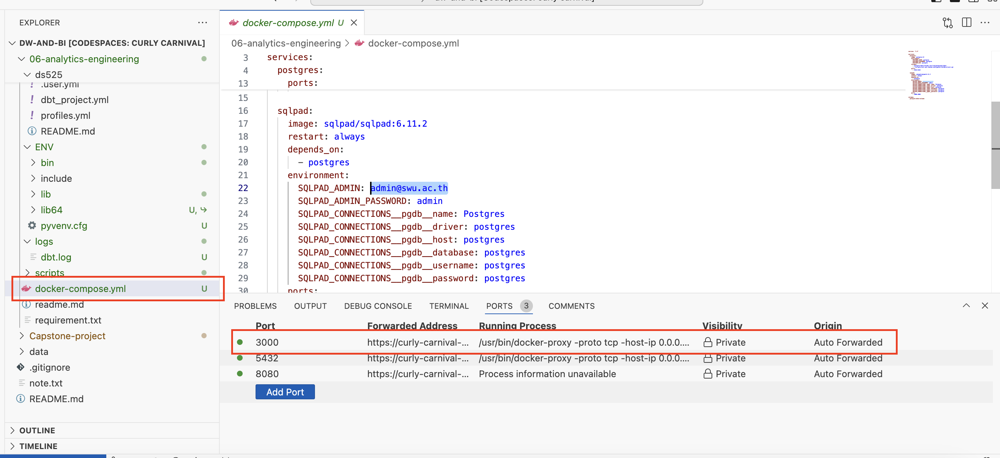
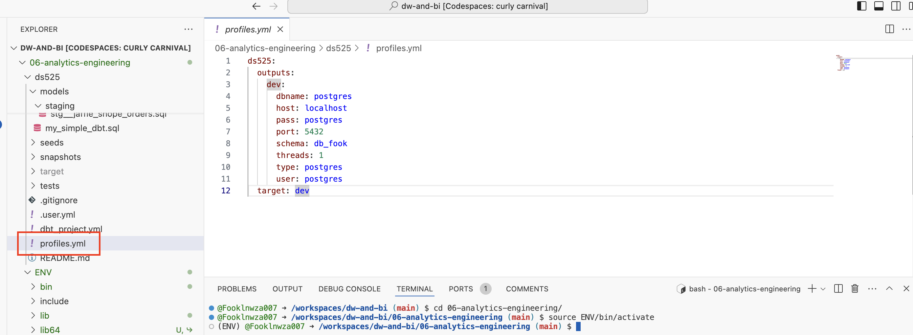
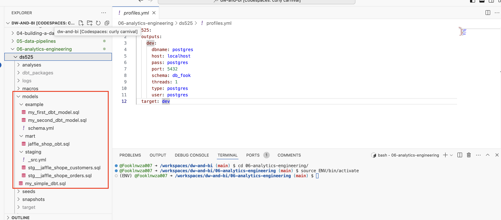
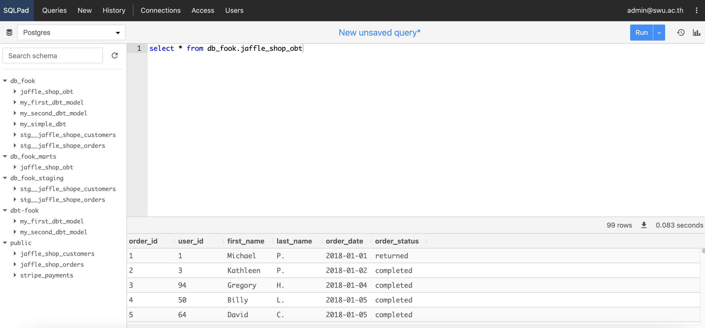

# Instruction

1. เข้าไปใน Folder 06-analytics-engineering
```sh
cd 06-analytics-engineering
```
1. สร้าง web server postgres ด้วย docker port 3000
```sh
docker compose up
```



2. สร้าง ENV สำหรับการเขียน code Python และเก็บ package
```sh
python -m venv ENV
```
3. Activate เพื่อเข้าไปใน ENV เพื่อเก็บ package ต่างๆ
```sh
source ENV/bin/activate
```
4. download package สำหรับการใช้งาน dbt และ postgres
```sh
pip install dbt-core dbt-postgres
```
5. สร้างระบบฐานข้อมูลใน postgres และสร้าง profiles project ชื่อ ds525
```sh
dbt init
```


6. เข้าไปใน Folder ds525 (ยังอยู่ใน ENV)
```sh
cd ds525
```
7. หลังจากสร้าง profiles project สร้าง file ใน folder ds525/models ด้วยชื่อ profiles.yml
และนำข้อมูลทั้งหมดจาก code ด้านล่าง มาใส่ไว้ใน file profiles.yml ที่เราสร้างใน ds525/models 
```sh
code /home/codespace/.dbt/profiles.yml
```



8. ทดสอบการ connection กับ postgres
```sh
dbt debug
```


9. ทดสอบการ connection กับ postgres
```sh
dbt debug
```


10. การนำข้อมูลขึ้นบน postgres จะใช้ข้อมูลจาก ds525/models .sql และใช้โครงสร้างในการ source ข้อมูลจาก _src.yml /
dbt_project.yml ใช้ในการกำหนดโครงสร้างชื่อหรือประเภท tables/view ที่สร้าง และไม่สนใจโครงสร้างของ folder
```sh
dbt run
```






11. จากนั้นรันคำสั่ง test เพื่อเช็ค data quality
```sh
dbt test
```


12. ออกจาก ENV
```sh
deactivate
```
13. ปิดการทำงาน docker
```sh
docker compose down
```
